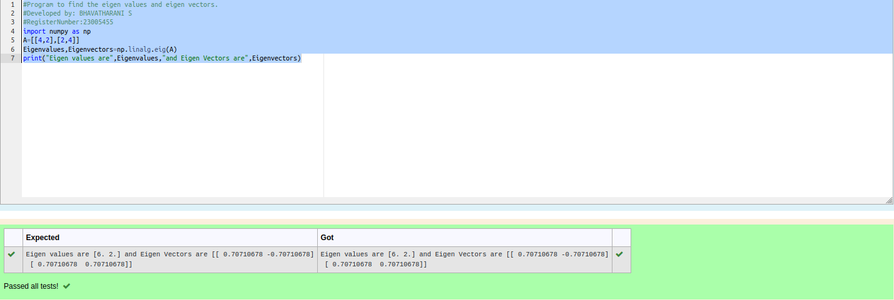

# EIGENVALUES-AND-EIGENVECTORS
## Aim:
To write a python program to find the Eigenvalues and Eigen Vectors
## Equipment’s required:
1. 	Hardware – PCs
2. 	Anaconda – Python 3.7 Installation / Moodle-Code Runner
## Algorithm:
### Step1 :
 Form a matrix
### Step 2: 
Give the values
### Step 3: 
Using the np.linalg.eig(),  we get two results (first is eigenvalue and second is eigenvector) of the given matrix.
### Step 4: 
Run the program

## Program:
```
#Program to find the eigen values and eigen vectors.
#Developed by: BHAVATHARANI S
#RegisterNumber:23005455
import numpy as np
A=[[4,2],[2,4]]
Eigenvalues,Eigenvectors=np.linalg.eig(A)
print("Eigen values are",Eigenvalues,"and Eigen Vectors are",Eigenvectors)
```
## Output:
!


## Result:
Thus the Eigenvalue and Eigenvector is successfully solved using python program
